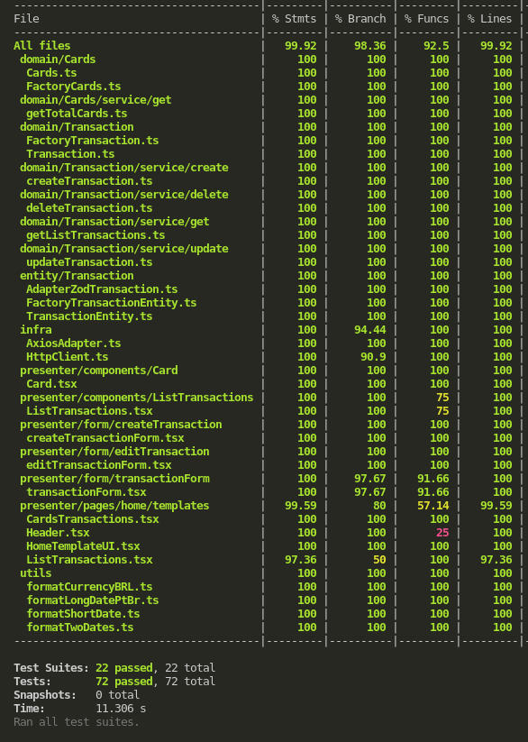

# My Finance

## Descrição do Projeto

My finance é um projeto de controle de finanças pessoais, onde o usuário pode cadastrar suas receitas e despesas, e ter um controle de seus gastos.

## Como rodar a aplicação

### No diretório do projeto, você pode rodar:

Para instalar as dependências do projeto:

```bash
 npm install
```

Para rodar a aplicação em modo de desenvolvimento:

```bash
 npm start
```

Para rodar os testes da aplicação:

```bash
 npm test
```

Obs: A versao do node utilizada no projeto é a 18.16.0

## Tecnologias utilizadas

- React Native

  Permitiu o desenvolvimento de uma aplicação mobile nativa para Android e iOS, utilizando Typescript.

- Typescript

  Utilizado para adicionar tipagem estática ao Javascript, garantindo a integridade do código e facilitando a manutenção.

- Jest

  Utilizado para fazer os testes unitários da aplicação.

- Axios

  Utilizado para fazer as requisições HTTP para a API de backend.

- Zod

  Utilizado para fazer a validação dos dados de entrada da aplicação.

- Expo

  Utilizado para facilitar o desenvolvimento da aplicação, fornecendo ferramentas para o desenvolvimento e testes da aplicação.

## Arquitetura

A arquitetura utilizada foi a Clean Architecture, SOLID e DDD, onde o projeto é dividido em camadas, sendo elas:

- Presentation Layer: Responsável pela interface do usuário e interação com o usuário. Nesse caso, foi utilizado o React Native para desenvolver a interface do aplicativo.

- Domain Layer: Responsável pelas regras de negócio e lógica do aplicativo. Aqui, foram aplicados conceitos de Domain-Driven Design (DDD) para separar as entidades, objetos de valor, serviços e interfaces necessárias para o funcionamento do aplicativo.

- Data Layer: Responsável pelo acesso aos dados e persistência. Nesse projeto, foi utilizado o Axios para fazer as requisições HTTP para a API de backend.

- Test Layer: Responsável pelos testes automatizados do projeto. Foram utilizados os testes unitários com Jest para garantir a qualidade e a integridade do código.


## Features

<div> 


</div>
<div> 


</div>
